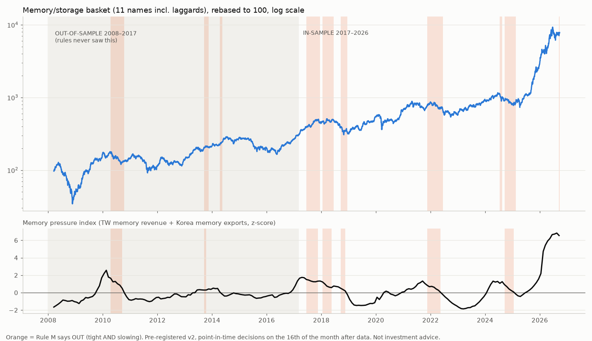

# bottleneck-signals

The AI buildout runs into physical bottlenecks: memory, optics, power equipment. This repo tracks those shortages with free, dated, public data, tests whether the data leads the stocks, and keeps a **hash-chained, publicly timestamped log** of every monthly call, misses included.

> **Not investment advice.** These are model outputs from a research project. Past and back-tested results do not predict future returns.

## Leadtime (the website)

`web/` is **Leadtime**, a site built on this repo. It covers 28 bottlenecks across AI compute, power and robotics (`config/themes.json`), each with its evidence series, listed exposure and model call. It also includes a discovery feed, a track record page with chain verification, and alert delivery by Discord, Slack, phone push (ntfy), webhook, Telegram, email and SMS.

- **Model v6** (all themes, [`RESULTS_v6.md`](backtest/RESULTS_v6.md)): 6 of 19 testable themes pass their out-of-sample tilt test; memory keeps Rule M. The rest are shown as *monitoring*, with no call.
- **Discovery scanner v5** ([`RESULTS_v5.md`](backtest/RESULTS_v5.md)): the average flag beats the market out of sample; the median flag doesn't. Treat flags as leads, not buy signals.
- **Code:** `engine/build.py` writes `web/data/snapshot.json`; `engine/dispatch.py` sends alerts, deduplicated per channel; `web/app/` is FastAPI + Jinja; `web/notify/` holds the channel adapters.
- **Run locally:** `cd web && LEADTIME_SECRET=dev ../.venv/bin/uvicorn app.main:app --port 8911`

## Model v4 status (2026-09-23)

**Memory / storage**
- **Test:** timing (IN/OUT). Out-of-sample 2008–2017: **PASS**. CAGR 15.9% vs 13.0%, Sharpe 0.71 vs 0.60.
- **Live call:** **OUT** (C 5.33, M −0.15).

**Optics**
- **Test:** tilt vs SOXX. **PASS, marginal** (Sharpe 0.32 vs 0.30).
- **Live call:** **OVERWEIGHT**.

**Power equipment**
- **Test:** tilt vs XLI, using TW revenue + PPI. **PASS** (Sharpe 0.48 vs −0.18).
- **Live call:** **OVERWEIGHT**.

Details: [`backtest/RESULTS_v4.md`](backtest/RESULTS_v4.md). Earlier versions are in `RESULTS_v1.md`, `RESULTS_v2.md` and `v3_power_results.json`.



## Signals (all free and point-in-time)

**Taiwan monthly revenue** (MOPS, 2005 onward), usable from the 10th of the next month:
- **Memory:** Nanya, Winbond, Macronix, Transcend, Phison, ADATA
- **Optics:** LandMark, VPEC, Browave, FOCI, Accton
- **Heavy electrical:** Fortune, Shihlin, Chung-Hsin, Allis

**Other sources:**
- Korea memory-IC exports (Korea Customs Service, tradedata.go.kr, HS 854232; validated against UN Comtrade)
- US imports of power transformers and switchgear (Census, HS 850421/2/3 and 853720)

Each series becomes a year-over-year z-score (expanding window). A bottleneck's **pressure index C** is the average z-score of its series, and **momentum M** is C minus C three months earlier.

The rules:
- **Memory:** get out when C > 0 and M < 0 (tight and slowing).
- **Optics and power:** stay in only while C > 0.

## How honesty is enforced

- **Pre-registration.** The rules for each version were written and SHA-256-hashed before any result was computed: `backtest/PREREGISTRATION*.md` plus their `.sha256` files. Old versions are never edited; each change is a new version.
  - ⚠️ Versions v1–v3 were written and hashed locally on 2026-09-23 and only published with this repo's first commit. From here on, the git history is the public timestamp.
- **Forward log.** `backtest/signal_log.jsonl` gets one entry per month. Each entry contains the SHA-256 of the previous one, plus the basket prices on the day of the call.
- **Monthly run.** `pipeline/monthly.py` runs on the 17th of each month and pushes the new entry here.

## Reproduce

```bash
python -m venv .venv && .venv/bin/pip install -r requirements.txt
echo "CENSUS_API_KEY=<your free key>" > .env        # https://api.census.gov/data/key_signup.html
.venv/bin/python pipeline/fetch_tw.py 2005          # about 10 min, cached
.venv/bin/python pipeline/fetch_market.py           # prices (not redistributed here), FRED, SEC
.venv/bin/python pipeline/fetch_comtrade.py
.venv/bin/python pipeline/fetch_census.py
.venv/bin/python pipeline/fetch_korea_customs.py
.venv/bin/python backtest/run_v4.py
# Leadtime site data
.venv/bin/python pipeline/fetch_census_all.py       # all HS6 in ch. 28/84/85/90, 2013+
.venv/bin/python pipeline/fetch_universe_prices.py  # basket prices (not redistributed)
.venv/bin/python pipeline/discovery.py
.venv/bin/python engine/build.py
```

## Known limits
- **Survivorship bias:** delisted names such as old SanDisk, Elpida and Finisar cannot be priced.
- **Short history:** about 6 memory cycles, and power import data only from 2013.
- **Revised data:** the PPI series use revised values rather than the values available at the time.

Code: MIT. Data remains the property of its sources: MOPS/TWSE, UN Comtrade, the US Census Bureau, FRED/BLS and SEC EDGAR.
